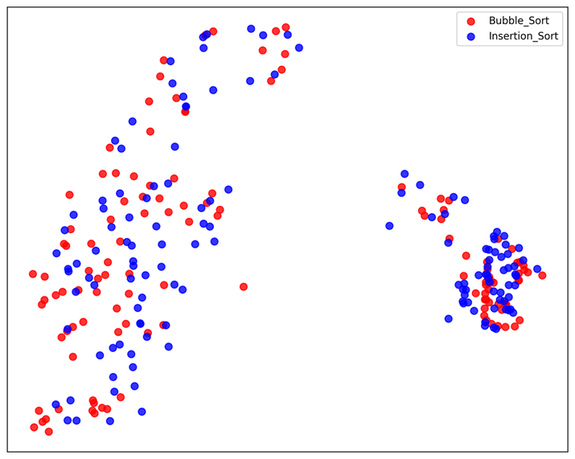
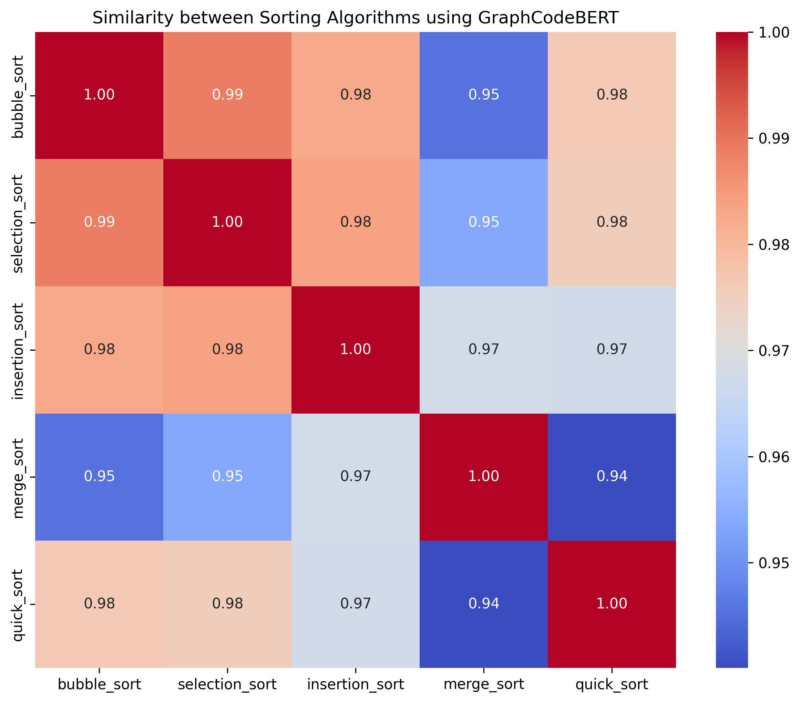

# Augmenting the Interpretability of GraphCodeBERT for Code Similarity Tasks

[](https://doi.org/10.1142/S0218194025500160)
[](https://arxiv.org/abs/2410.05275)
[](LICENSE)
[](https://www.python.org/downloads/)

[](https://scholar.google.com/citations?view_op=view_citation&hl=en&citation_for_view=X1pRUYcAAAAJ:0qX8s2k1IRwC)
[](https://github.com/jorge-martinez-gil/graphcodebert-interpretability/stargazers)
[](https://github.com/jorge-martinez-gil/graphcodebert-interpretability/network/members)
[](https://colab.research.google.com/github/jorge-martinez-gil/graphcodebert-interpretability/blob/main/examples/demo_similarity.ipynb)

> **Official implementation** of the IJSEKE publication:
> Martinez-Gil, J. (2025). *Augmenting the Interpretability of GraphCodeBERT for Code Similarity Tasks*. *International Journal of Software Engineering and Knowledge Engineering*, 35(05), 657–678.

## Abstract
Code similarity models are increasingly used in software engineering workflows, yet their decisions are often difficult to interpret. This repository accompanies our IJSEKE paper and presents a practical interpretability framework around GraphCodeBERT for code similarity tasks. We combine complementary lenses—token-level cosine similarity, PCA, t-SNE, UMAP, and gradient-based saliency maps—to expose how semantic and structural relationships emerge across classical sorting algorithms. Results consistently show that algorithms with closer computational behavior (e.g., Bubble Sort and Insertion Sort) occupy nearby embedding regions and exhibit aligned token saliency patterns, improving trust and explainability in model outputs.

## Table of Contents
- [Key Contributions](#key-contributions)
- [Methodology Overview](#methodology-overview)
- [Results](#results)
- [Repository Structure](#repository-structure)
- [Quick Start](#quick-start)
- [Usage Examples](#usage-examples)
- [Visualizations Gallery](#visualizations-gallery)
- [How to Cite](#how-to-cite)
- [Related Work / See Also](#related-work--see-also)
- [Reproducibility](#reproducibility)
- [Contributing](#contributing)
- [Acknowledgements](#acknowledgements)
- [License](#license)

## Key Contributions
- Introduces a multi-lens interpretability workflow tailored to GraphCodeBERT code-similarity analysis.
- Provides token-level and projection-based visual diagnostics for pairwise algorithm comparisons.
- Bridges semantic, structural, and textual baselines through AST and TF-IDF companion analyses.
- Releases reproducible scripts, figures, and a Colab-ready notebook to accelerate follow-up research.

## Methodology Overview
This repository operationalizes five complementary interpretability lenses:

1. **Token-level cosine similarity** (`comparison.py`): computes fine-grained pairwise token alignment and generates HTML highlights.
2. **PCA** (`pca.py`): projects token embeddings into 2D spaces that preserve dominant variance directions.
3. **t-SNE** (`tsne.py`): captures local neighborhood structure in non-linear manifolds of token embeddings.
4. **UMAP** (`pumap.py`): provides topology-aware low-dimensional projections with strong cluster separation.
5. **Saliency Maps** (`saliency_maps.py`): uses input-gradient magnitudes to estimate token importance for model activations.

## Results
Across projection methods and saliency analysis, structurally related algorithms tend to group together. In particular, **Bubble Sort and Insertion Sort embeddings cluster closely under all projections**, reflecting their procedural similarity. The heatmap output further supports this trend with strong pairwise similarity among quadratic-time in-place sorting strategies.

Representative outputs are available in:
- `Bubble_Sort_vs_Insertion_Sort_tokens_2d_pca.png`
- `sorting_algorithms_similarity.png`

## Repository Structure

| File | Description |
|------|-------------|
| `comparison.py` | Token-level cosine similarity and HTML highlight generation |
| `heatmap.py` | Similarity heatmap across sorting algorithm pairs |
| `pca.py` | PCA 2D/3D projection of token embeddings |
| `tsne.py` | t-SNE projection of token embeddings |
| `pumap.py` | UMAP projection of token embeddings |
| `saliency_maps.py` | Gradient-based saliency maps per token |
| `ablation.py` | Ablation study scripts |
| `ast-s.py` | AST-based structural similarity |
| `tf-s.py` | TF-IDF textual similarity baseline |

## Quick Start
```bash
git clone https://github.com/jorge-martinez-gil/graphcodebert-interpretability.git
cd graphcodebert-interpretability
python -m venv .venv
source .venv/bin/activate  # On Windows: .venv\Scripts\activate
pip install --upgrade pip
pip install -r requirements.txt
```

## Usage Examples
Run each script from the repository root:

```bash
python comparison.py      # Produces code_similarity.html with token-level highlights and a final similarity score
python heatmap.py         # Produces sorting_algorithms_similarity.png (global pairwise similarity heatmap)
python pca.py             # Produces PNG files in pca_pairwise_comparisons/
python tsne.py            # Produces PNG files in tsne_pairwise_comparisons/
python pumap.py           # Produces PNG files in umap_pairwise_comparisons/
python saliency_maps.py   # Produces PNG files in saliency_maps/
python ablation.py        # Produces PNG files in ablation_study_results/
python ast-s.py           # Produces PNG files in ast_tree_kernel_visualizations/
python tf-s.py            # Produces PNG files in cosine_similarity_visualizations/
```

## Visualizations Gallery

*Figure 1. PCA token-level projection showing close embedding neighborhoods for Bubble Sort and Insertion Sort.*


*Figure 2. Pairwise GraphCodeBERT similarity heatmap across classical sorting implementations.*

## How to Cite
If you use this work, please cite:

```bibtex
@article{martinezgil2025augmenting,
      author = {Martinez-Gil, Jorge},
      title = {Augmenting the Interpretability of GraphCodeBERT for Code Similarity Tasks},
      journal = {International Journal of Software Engineering and Knowledge Engineering},
      volume = {35},
      number = {05},
      pages = {657-678},
      year = {2025},
      doi = {10.1142/S0218194025500160},
      URL = {https://doi.org/10.1142/S0218194025500160}
}
```

A machine-readable citation is also provided in [`CITATION.cff`](CITATION.cff).

## Related Work / See Also
- GraphCodeBERT: [CodeBERT: A Pre-Trained Model for Programming and Natural Languages](https://arxiv.org/abs/2009.08366)
- Vig, J. (2019). [A Multiscale Visualization of Attention in the Transformer Model](https://arxiv.org/abs/1906.05714)
- Jain, S., & Wallace, B. C. (2019). [Attention is not Explanation](https://arxiv.org/abs/1902.10186)

## Reproducibility
See the complete guide in [`docs/REPRODUCIBILITY.md`](docs/REPRODUCIBILITY.md), including runtime estimates and deterministic configuration notes.

## Contributing
Contributions are welcome. Please read [`CONTRIBUTING.md`](CONTRIBUTING.md) before opening an issue or submitting improvements.

## Acknowledgements
This repository accompanies the IJSEKE publication and was prepared to support transparent and reproducible code-similarity interpretability research.

## License
[](LICENSE)

This project is licensed under the MIT License. See [LICENSE](LICENSE).
